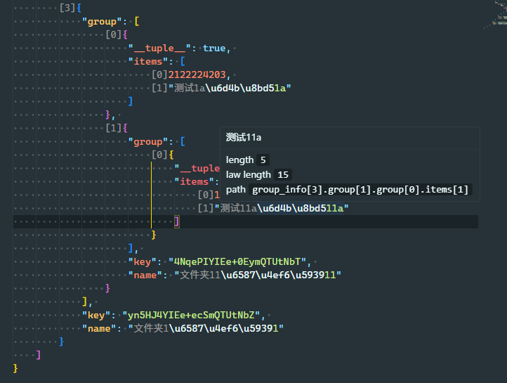

# JSON-Cat README

* Display the actual value of the escaped string.
* Display the complete path of the node.
* Display the index of the node within the array.

You can hide the sections you don't like by adjusting the settings.

## Preview

